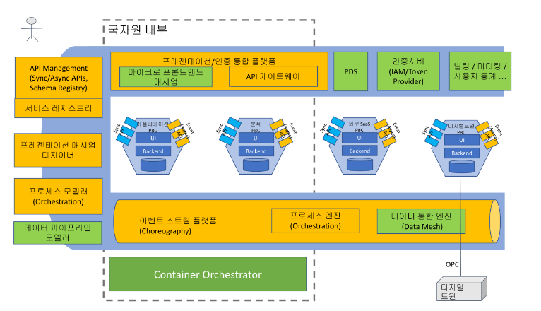
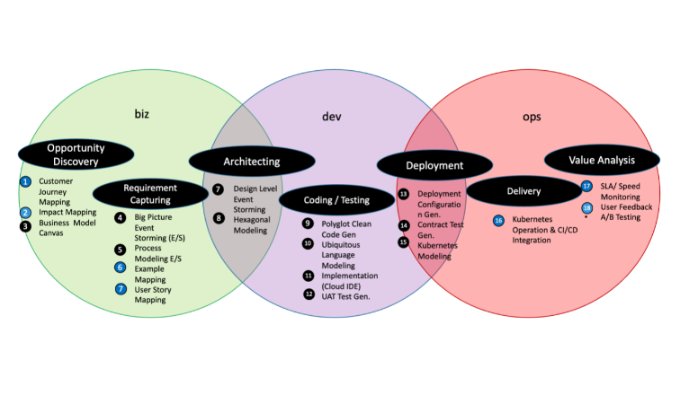

# 데이터 파이프라인 Specification

* 기존 데이터 파이프라인 시스템의 한계 및 문제점
  * 다양한 서비스들의 자유로운 연동과 실시간 대응, 서비스간 트랜잭션 처리등이 불가능: 다양한 플랫폼 기반(java, python, node..등)의 설치형 서비스 혹은 SaaS 서비스 들이 자유롭게 통합되고 서비스간 데이터 공유 및 데이터 쓰기(mutation) 의 트랜잭션 관리가 어려움
  * 서비스간의 강한 결합도: 데이터베이스 공유 혹은 직접 액세스, 혹은 중앙집중식 EAI 나 /동기식 서비스 연동 방식에 의한 연동으로 서비스간 결합도가 높아 시스템 변경에 대한 자율성 저하, 장애 발생시 장애 전파 문제 발생
  * 이는, 전체적으로 국민 서비스의 개선이나 서비스 질을 저해하는 요인으로 작용하고 있음
  * 정부 시스템 내의 데이터 (사용자 데이터, 처리 데이터, 환경데이터,...) 등, 빅데이터 분석용도의 국가 자원이 될 수 있는 데이터들이 체계적으로 관리되지 못하고 있으며, 특히 이후 시계열 분석 등의 토대가 될 수 있도록 시계열의 Historical 한 데이터의 형식으로 보존되지 못하고 있음.


* 개선 방안
  * Open API/Async API 등 Open 된 API 를 기반으로 서비스간 동기/비동기식 연동을 가능하게 함
  * 트랜잭션 처리에 있어서는 이벤트 기반의 통합 서비스/데이터 파이프라인을 구축하여 다양한 플랫폼 기반의 서비스간 결합도를 최소화하면서 시스템간 연동이 이루어질 수 있도록 함.
  * 세부적으로, 이벤트 기반의 Publish / Subscribe 형식의 비동기식 / 구독형 연동으로, 각 서비스나 설치형 서비스들이 각자의 플랫폼으로 구축될 수 있도록 하며 중앙의 데이터에 직접적인 액세스 없이도 각 서비스들은 이벤트 데이터를 수신하여 자체적인 데이터베이스 설계를 기반으로 한 Polyglot Database 를 구축할 수 있도록 함
  * 각 부처별 데이터 포맷의 통일이 어렵기 때문에 데이터 통합을 위한 Pub/Sub 기반으로 연동하여야 하며 Anti-corruption Layer(어댑터 및 데이터 매퍼) 를 기반으로 연동한다.
  * API 는 중앙의 API management tool 에 의하여 관리될 수 있도록 함. API management 에서는 API 가 Frontend API 인 경우 iframe API, script api, , Backend API 인 경우 Sync/Async 두가지 모델에 대한 표준 API 정의 Spec 인 Open API\[] 와 Async API\[] 를 적용함
  * 셀프서비스화/자동화된 프로비져닝을 위한 서비스 메타데이터 표준화: 서비스 사용자 (국민, 공공기관, 기업) 들이 다양한 공공서비스 및 민간 서비스들을 간단한 low-code/no-code 툴을 통하여 매시업하여 곧바로 통합된 서비스를 제공받을 수 있도록 하기 위해서는 일반 SaaS형식인 경우 서비스 가격 정보, 보안/인증, 데이터연동API, 프론트엔드API, 서비스연동API, 서비스 관리 / 커스터마이징 / 설정 API 등의 메타데이터들을 엑세스 할 수 있는 URI를 제공해주어야 하며, 설치형 서비스인 경우의 라이센싱 가격, 배포 인프라별 프로비저닝 자동화 스크립트 혹은 쿠버네티스의 경우 이미지명 혹은 helm chart 등의 설치 자동화 메타데이터가 표준화된 방식으로 제공되어야 함
  * 이러한 표준화된 서비스의 규격화가 어느정도 이루어져야만 마켓플레이스 등에서 유통될 수 있는 형식의 서비스 및 컴포넌트가 될 수 있으며, 이를 가칭으로 PBC (Packaged Business Service) 라고 일컬음 \[]
* 설계 원칙


* 시스템 통합에 관련한 보다 유연한 연동을 위한 Composable Enterprise 개념을 차용함
  * Composable Enterprise는 비즈니스 요구 사항을 빠르게 충족하고 조정할 수 있는 유연하고 모듈화된 비즈니스 아키텍처를 지원하기 위해 설계된 개념입니다. 이를 위해서는 비즈니스 능력을 모듈화된 형태로 개발하고 배포할 수 있어야 합니다.
  * Packaged Business Capabilities(PBC)는 이러한 목표를 달성하기 위한 전략 중 하나로, 비즈니스 능력을 모듈화된 형태로 개발하여 조립 가능한 구성 요소로 제공합니다. 이를 통해 조립 가능한 PBC를 이용하여 비즈니스 요구 사항을 더 빠르게 구현할 수 있습니다.
  * CBD(Componet-Based Development)에서는 컴포넌트 또는 마이크로서비스가 PBC와 유사한 개념입니다. 그러나 PBC는 컴포넌트 또는 마이크로서비스보다 더 큰 범위의 비즈니스 능력을 가지고 있으며, 비즈니스 능력을 개발하는 것뿐만 아니라, 비즈니스 프로세스와 조직 구조를 포함한 비즈니스 전략을 모듈화하여 제공합니다. 따라서 PBC는 비즈니스 요구 사항을 더 적극적으로 충족시키고, 조직 전반에 걸쳐 재사용이 가능한 능력을 제공합니다.
* 다음은 각 서비스들이 PBC 의 형태가 되기 위하여 갖추어야 할 요건 들입니다:
  * Self-descriptive : Open API (sync API), Async API, endpoint url 정보, image 정보, 구현체, 빌드 방법, Dockerfile 등의 메타데이터를 포함하고 있어야 한다. diff: 일반 helm chart에 비해…
  * Self-contained: Front-end 요소, backend, database, 내부적인 event platform이나 infra 요소들을 모두 가지고 있고 이들을 설치 구동할 수 있는 provisioning script 가 내재된 operator 형태로 존재한다.
  * Build-time 의 지원 (ci/cd)가 포함된다. on-prem설치, license 의 유형이 saas 형식이 아닌 licensed 혹은 오픈소스들의 빌드 단계를 동반하는 연동이 이루어질 수 있다.
  * 특정기술에 종속되지 않아야 한다: webcomponents, open api/async api, cloud events, REST, CRI runtime (image) 등의 표준 혹은 적어도 10년 이상 유지될 수 있는 사실 표준을 준수해야 한다.
  * business bounded: DDD 설계 전략이 녹아야 한다. 이를 설명하기 힘들것임.
  * Event-driven, pub/sub, white-board pattern 등 한 연동 (DDD) 등 loosely coupled 한 연동을 지향해야 한다.
* 개인정보 보호 이슈:

Event Driven Architecture(EDA)는 시스템에서 이벤트가 발생했을 때 이벤트를 처리하기 위한 아키텍처 패턴입니다. EDA를 개인정보에 대한 데이터 공유에 적용하면, 다음과 같은 문제점이 발생할 수 있습니다.

1. 개인정보 노출: 이벤트가 발생하면 해당 이벤트를 처리하기 위한 시스템에서 개인정보가 필요할 수 있습니다. 이 경우, 개인정보가 불필요하게 많은 시스템에 노출될 가능성이 있습니다.
2. 보안성 문제: 이벤트는 분산 시스템에서 전달되기 때문에 이벤트를 전송하는 과정에서 보안성 문제가 발생할 수 있습니다. 이 경우, 개인정보가 해커나 악의적인 사용자에게 노출될 가능성이 있습니다.
3. 데이터 일관성 문제: 여러 시스템에서 이벤트를 처리하는 경우, 각 시스템에서 데이터의 일관성을 보장하기 위한 추가적인 작업이 필요할 수 있습니다.

이러한 문제점을 해결하기 위한 방안으로는 다음과 같은 것들이 있습니다.

1. 데이터 최소화: 개인정보를 최소한으로 제공하여 개인정보 노출을 최소화합니다. 개인정보를 처리해야 하는 시스템에만 개인정보를 전달합니다.
2. 보안 강화: 이벤트 전송과 이벤트 처리를 위한 시스템 간의 보안 강화를 통해 보안성 문제를 해결합니다. 이를 위해 암호화, 인증, 권한 제어 등의 보안 기술을 적용할 수 있습니다.
3. 데이터 일관성 보장: 각 시스템에서 데이터 일관성을 보장하기 위한 추가적인 작업으로는, 데이터 버전 관리, 데이터 동기화 등의 방법이 있습니다. 이를 위해 마스터 데이터 관리(MDM) 시스템을 사용할 수도 있습니다.
4. 개인정보 처리 방침 수립: 개인정보 처리 방침을 수립하여 개인정보 보호에 대한 책임을 명확하게 하고, 이를 준수하는 것이 중요합니다.

EDA를 적용할 때에는 개인정보 보호에 대한 문제점을 고려하여 적절한 보안 조치를 취하고, 관련 법규와 규정을 준수하는 것이 중요합니다. - polyglot 언어, polyglot persistency 등… 을 지원할 수 있어야 한다.. . machine learning 등, 분석 PBCs, IoT (Digital Twins) 에 대한 이벤트를 수신 분석 할 수 있어야 하는 비동기 지원이 필수이다. 비동기성.

* 설계원칙에 + CNA attibutes, digital twin composable enterprises 등을 출처로\
  \

* 아키텍처 - 기존 레가시, 동기/비동기, acid tx vs. base tx - tp monitor, RBAC, scale, 정부24, 개인톡, …활동계획, 킬러시나리오→ Reference Implementation Open Source Project



*   이벤트 스트림 플랫폼

    * 이벤트 스트림 브로커

    이벤트 스트림 플랫폼(Event Stream Platform)은 대규모 실시간 이벤트 처리를 위한 인프라를 제공하는 데이터 플랫폼입니다. 이벤트 스트림 플랫폼은 대규모 이벤트 데이터를 수집하고 분석하여 실시간으로 유용한 인사이트를 도출하는 데 사용됩니다.

    이벤트 스트림 플랫폼은 이벤트를 스트림으로 처리하는 방식으로 작동합니다. 이벤트는 스트림에 연속적으로 전송되며, 이 스트림은 이벤트 데이터를 수집하고 처리하기 위한 다양한 기능을 제공합니다. 예를 들어, 이벤트 스트림 플랫폼은 이벤트를 실시간으로 처리하고 필터링하며, 이벤트 스트림을 분할하여 여러 사용자 그룹이나 애플리케이션에 전달할 수 있습니다. 또한, 이벤트 스트림 플랫폼은 이벤트 데이터를 저장하고 이를 기반으로 분석을 수행할 수 있습니다.

    이벤트 스트림 플랫폼은 인터넷 오브 씽스(IoT), 실시간 로깅, 보안 모니터링, 애플리케이션 모니터링 등 다양한 분야에서 사용됩니다. 대표적인 이벤트 스트림 플랫폼으로는 Apache Kafka, AWS Kinesis, Google Cloud Pub/Sub, Microsoft Azure Event Hubs 등이 있습니다.

    * 비즈니스 프로세스 엔진

    서비스들간의 연동관계를 비즈니스 프로세스를 기준으로 관리하기 위한 종합적인 시스템입니다. BPMS의 구성요소에는 다음과 같은 것들이 있습니다:

<<<<<<< HEAD
    1. Process Modeling Tool: BPMS에서 프로세스를 모델링하기 위한 도구입니다. 이
도구를 사용하여 프로세스의 다양한 단계와 작업을 시각화하고, 비즈니스 규칙,
프로세스 흐름 및 상호 작용 등을 정의할 수 있습니다.
    2. Business Rules Engine: BPMS는 비즈니스 규칙을 적용하기 위한 Business Rules
Engine을 포함합니다. 이 엔진은 프로세스의 동작에 영향을 미치는 다양한 규칙과
조건을 정의할 수 있습니다.
    3. Workflow Engine: BPMS는 Workflow Engine을 통해 프로세스를 자동화하고 실행할
수 있습니다. Workflow Engine은 프로세스의 각 단계에서 수행되어야 하는 작업을
지정하고, 각 작업을 적절한 시간에 실행합니다.
    4. Business Activity Monitoring (BAM) Tool: BPMS는 BAM 도구를 사용하여 프로세스
실행 및 성능을 모니터링합니다. 이 도구를 사용하면 프로세스 실행 중에 예외
사항이 발생하면 즉시 대응할 수 있습니다.
    5. Collaboration Tools: BPMS는 다양한 협업 도구를 포함합니다. 이러한 도구는
사용자가 프로세스를 공동으로 작업하고, 팀 간 효율적인 의사 소통을 지원합니다.
    6. Integration Tools: BPMS는 시스템 간 데이터 통합을 위한 다양한 통합 도구를
제공합니다. 이러한 도구는 외부 시스템과의 데이터 통합을 용이하게 해주며, 다른
애플리케이션과의 통합도 가능합니다.
    7. Analytics Tools: BPMS는 다양한 분석 도구를 제공하여 프로세스 실행 및 성능에
대한 분석을 수행할 수 있습니다. 이러한 분석 도구를 사용하면 프로세스의 병목
현상을 식별하고, 향후 개선을 위한 방향성을 제시할 수 있습니다.
=======
    1. Process Modeling Tool: BPMS에서 프로세스를 모델링하기 위한 도구입니다. 이 도구를 사용하여 프로세스의 다양한 단계와 작업을 시각화하고, 비즈니스 규칙, 프로세스 흐름 및 상호 작용 등을 정의할 수 있습니다.
    2. Business Rules Engine: BPMS는 비즈니스 규칙을 적용하기 위한 Business Rules Engine을 포함합니다. 이 엔진은 프로세스의 동작에 영향을 미치는 다양한 규칙과 조건을 정의할 수 있습니다.
    3. Workflow Engine: BPMS는 Workflow Engine을 통해 프로세스를 자동화하고 실행할 수 있습니다. Workflow Engine은 프로세스의 각 단계에서 수행되어야 하는 작업을 지정하고, 각 작업을 적절한 시간에 실행합니다.
    4. Business Activity Monitoring (BAM) Tool: BPMS는 BAM 도구를 사용하여 프로세스 실행 및 성능을 모니터링합니다. 이 도구를 사용하면 프로세스 실행 중에 예외 사항이 발생하면 즉시 대응할 수 있습니다.
    5. Collaboration Tools: BPMS는 다양한 협업 도구를 포함합니다. 이러한 도구는 사용자가 프로세스를 공동으로 작업하고, 팀 간 효율적인 의사 소통을 지원합니다.
    6. Integration Tools: BPMS는 시스템 간 데이터 통합을 위한 다양한 통합 도구를 제공합니다. 이러한 도구는 외부 시스템과의 데이터 통합을 용이하게 해주며, 다른 애플리케이션과의 통합도 가능합니다.
    7. Analytics Tools: BPMS는 다양한 분석 도구를 제공하여 프로세스 실행 및 성능에 대한 분석을 수행할 수 있습니다. 이러한 분석 도구를 사용하면 프로세스의 병목 현상을 식별하고, 향후 개선을 위한 방향성을 제시할 수 있습니다.
    8. 데이터 통합 엔진
*   데이터 매시 기반의 통합 엔진
>>>>>>> 658ae36590b420941797b29c599f1784d03dd145

    데이터 메시 (Data Mesh)는 분산 시스템 아키텍처를 적용하여 조직 내부에서 데이터를 관리하는 방식입니다. 이는 기업 내에서 데이터 품질과 데이터 접근성을 개선하며, 데이터를 팀이나 도메인 간에 공유하고 재사용하기 쉽게 만듭니다.


데이터 메시는 중앙 집중화된 데이터 관리 방식과는 다릅니다. 대신, 데이터 메시는 분산 시스템 아키텍처를 적용하여, 조직 내부에서 팀이나 도메인 간에 데이터를 공유하고 재사용하기 쉽게 합니다. 이를 위해 데이터를 소유하는 팀이나 도메인이 데이터를 관리하고, 필요에 따라 다른 팀이나 도메인이 해당 데이터를 사용할 수 있도록 합니다.

데이터 메시의 핵심 원칙은 다음과 같습니다.

1. 데이터를 분산 시스템 아키텍처로 구성하고, 데이터를 소유하는 팀이나 도메인이 데이터를 관리합니다.
2. 데이터를 표준화하고, 각각의 데이터 요소에 대한 정확한 메타데이터를 생성하여 관리합니다.
3. 데이터를 공유하기 위한 표준화된 인터페이스를 제공합니다.
4. 데이터를 공유하고 재사용하기 위한 적절한 보안과 접근 제어를 적용합니다.

데이터 메시를 적용하면, 기업 내에서 데이터를 효과적으로 관리하고 활용할 수 있습니다. 이를 통해 데이터 품질이 향상되고, 데이터 접근성이 개선되며, 데이터의 재사용성이 높아집니다.

* 데이터 메시를 기반으로 하는 MLOps 아키텍처

데이터 메시를 기반으로 하는 MLOps 아키텍처는 머신 러닝 (ML) 모델을 개발하고 배포하는 프로세스를 자동화하며, 이를 위해 데이터 메시 원칙을 활용합니다.

머신 러닝 모델 개발은 대개 데이터 과학자, 개발자, 엔지니어 등 여러 역할의 팀으로 구성되어 진행됩니다. 이러한 다양한 역할과 데이터 메시 원칙을 고려하여, MLOps 아키텍처는 다음과 같은 구성요소를 포함합니다.

1. 데이터 메시: 데이터 메시를 통해 모델 개발에 필요한 데이터를 관리하고, 다른 팀이나 도메인과 공유할 수 있도록 합니다.
2. 데이터 엔지니어링: 데이터 엔지니어링을 통해 데이터를 수집, 전처리하고, 데이터 메시에 저장합니다. 이를 위해 데이터 파이프라인을 구축하며, 데이터 품질을 관리하고, 이를 위한 검증 및 모니터링을 수행합니다.
3. 모델 개발: 데이터 과학자와 개발자는 MLOps 아키텍처에서 모델 개발을 수행합니다. 이를 위해 머신 러닝 프레임워크와 개발 도구를 활용하며, 머신 러닝 모델을 학습시키고, 검증합니다.
4. 모델 배포: 모델 배포를 자동화하여, 실시간 예측을 수행할 수 있도록 합니다. 이를 위해 서버리스 아키텍처를 활용하며, 모델을 컨테이너화하여 배포합니다.
5. 모델 모니터링: 배포된 모델의 성능을 모니터링하고, 필요한 경우 모델을 재학습합니다. 이를 위해 모델 성능 지표를 정의하고, 이를 기반으로 모델의 성능을 평가합니다.

MLOps 아키텍처를 구성함으로써, 머신 러닝 모델을 효과적으로 개발하고 운영할 수 있습니다. 이를 통해 머신 러닝 모델의 개발과 배포 시간을 단축하고, 모델의 신뢰성과 성능을 개선할 수 있습니다.\
\


*   데이터 변환 도구

    이벤트 기반 아키텍처에서는 여러 시스템 간에 이벤트를 교환하고 처리합니다. 이 때 각 시스템에서 사용하는 메시지 포맷이 서로 다를 수 있습니다. 이러한 상황에서 메시지 포맷을 표준화하는 방법으로는 다음과 같은 방법들이 있습니다.

    1. Rethrow Eventing: Rethrow Eventing은 이벤트를 발생시키는 시스템에서 표준화되지 않은 메시지를 던지는 것이 아니라, 먼저 이벤트를 받은 시스템에서 해당 메시지를 이해할 수 있는 표준화된 형식으로 변환한 다음에 다시 이벤트를 발생시키는 방법입니다. 이를 통해 각 시스템에서 메시지를 변환하는 부담을 줄일 수 있습니다.
    2. Anti-corruption Layer: Anti-corruption Layer는 서로 다른 시스템 간에 메시지를 변환하기 위한 계층을 제공합니다. 이를 통해 각 시스템에서 사용하는 메시지 형식을 완전히 분리시키고, 각 시스템에서는 표준화된 형식으로만 통신할 수 있도록 합니다. 이를 통해 시스템 간의 결합도를 낮추고, 서로 독립적으로 발전할 수 있도록 합니다.
    3. Message Translation: Message Translation은 서로 다른 시스템 간에 메시지를 변환하는 일종의 번역기 역할을 합니다. 이를 통해 각 시스템에서 사용하는 메시지 형식을 변환하고, 표준화된 형식으로 변환된 메시지를 전달합니다.
    4. Canonical Data Model: Canonical Data Model은 서로 다른 시스템 간에 공통적으로 사용할 수 있는 데이터 모델을 정의합니다. 이를 통해 각 시스템에서 사용하는 데이터 모델을 표준화하고, 이를 기반으로 메시지를 변환합니다.

    이러한 방법들은 이벤트 기반 아키텍처에서 메시지 포맷을 표준화하는 데 유용합니다. 각 방법의 장단점과 상황에 따라 적절한 방법을 선택하여 사용하는 것이 중요합니다.

    * 프레젠테이션 / 인증 플랫폼
      * 마이크로 프론트엔드 매시업 플랫폼

    마이크로 프론트엔드 매시업 플랫폼은 기업에서 다양한 기술 스택과 프레임워크를 사용하는 서로 다른 팀이 협업하여 큰 규모의 UI 애플리케이션을 개발할 때 발생하는 문제를 해결하기 위한 솔루션입니다.

    

    기존의 모놀리식 프론트엔드 애플리케이션에서는 하나의 팀이 모든 UI 를 구현하고 유지보수하는 것이 일반적이었습니다. 하지만 최근에는 다양한 기술 스택과 프레임워크(React, Vue, Angular 등)를 사용하는 서로 다른 팀이 협업하여 애플리케이션을 개발하는 것이 일반적이 되었고, 이에 따라 서로 다른 기술 스택과 프레임워크를 사용하는 컴포넌트를 통합하는 것이 중요해졌습니다.

    마이크로 프론트엔드 매시업 플랫폼은 이러한 문제를 해결하기 위해, 각각의 팀이 작은 단위로 나누어 개발한 컴포넌트를 통합하여 큰 규모의 애플리케이션을 만들 수 있도록 도와줍니다. 이를 위해 다양한 기술 스택과 프레임워크를 지원하며, 각각의 컴포넌트를 독립적으로 개발하고 배포할 수 있습니다.

    마이크로 프론트엔드 매시업 플랫폼의 예시로는 single-spa, qiankun, openmircoservice 등이 있습니다. 이러한 플랫폼은 기존의 애플리케이션을 마이크로 서비스로 변환하여 관리할 수 있게 하고, 다양한 프론트엔드 기술을 유연하게 사용할 수 있도록 도와줍니다.


웹컴포넌트 표준의 적용

Web Component는 웹 개발에서 컴포넌트 기반 아키텍처를 구현하기 위한 표준입니다. 마이크로 프론트엔드 아키텍처에서도 Web Component를 사용하여 컴포넌트를 독립적으로 개발하고 배포할 수 있습니다.

Web Component는 다음과 같은 세 가지 기술로 구성됩니다.

Custom Elements

1. Custom Elements는 사용자 정의 HTML 태그를 만들 수 있는 기능입니다. 컴포넌트를 만들 때, Custom Elements를 사용하여 자체적으로 정의한 HTML 태그를 생성하고 사용할 수 있습니다.

Shadow DOM

2. Shadow DOM은 독립적인 DOM 트리를 만들 수 있는 기능입니다. 컴포넌트 내부에서 사용하는 CSS, JavaScript 등의 요소들은 Shadow DOM 내부에서 관리됩니다. 이를 통해, 다른 요소들과 충돌하지 않고 독립적으로 동작할 수 있습니다.

HTML Templates

3. HTML Templates는 미리 정의된 HTML 코드 덩어리를 저장하고 재사용할 수 있는 기능입니다. 컴포넌트 내부에서 사용할 HTML 코드를 미리 정의하여 HTML Templates에 저장하고 필요할 때마다 호출하여 사용할 수 있습니다.

마이크로 프론트엔드에서는 이러한 Web Component의 기술을 활용하여, 여러개의 서비스들이 각각의 UI 컴포넌트를 독립적으로 개발하고 배포할 수 있습니다. 이를 위해, 각각의 컴포넌트는 Custom Elements를 사용하여 자체적으로 정의한 HTML 태그를 생성하여 제공할 수 있으며, 이들을 통합하여 Seamless 한 통합된 SPA (Single Page Application) UI 를 구성할 수 있습니다.

WebComponent 기술의 적용과 iframe 과의 비교\
SPA(Single Page Application)는 클라이언트 측에서 모든 페이지를 렌더링하는 웹 어플리케이션입니다. SPA는 빠른 사용자 경험과 웹 페이지를 새로고침하지 않고 동적으로 업데이트할 수 있습니다. SPA에서는 보통 컴포넌트 기반 아키텍처를 사용하며, 이 컴포넌트들은 웹 페이지 내에서 서로 상호작용합니다.

Web Component는 웹 페이지 내에서 독립적으로 동작하는 커스텀 HTML 태그입니다. Web Component를 사용하면 애플리케이션의 컴포넌트를 캡슐화하고 재사용할 수 있으며, 다른 애플리케이션에서도 쉽게 사용할 수 있습니다. Web Component는 보통 Custom Element, Shadow DOM, HTML Templates, HTML Imports 등의 기술을 사용하여 구현합니다.

Iframe은 웹 페이지 내에서 다른 웹 페이지를 삽입하는 HTML 요소입니다. Iframe은 보통 외부 웹 페이지를 삽입하거나 광고를 삽입하는 데 사용됩니다. Iframe은 웹 페이지 내에서 완전히 독립적으로 작동하며, 웹 페이지의 스타일과 레이아웃을 변경하지 않습니다.

SPA에서 Web Component를 사용하면 웹 페이지 내에서 모든 컴포넌트를 독립적으로 작동하게 만들 수 있습니다. 이렇게 하면 웹 페이지의 레이아웃과 스타일을 유지하면서도 컴포넌트를 재사용하고 조합할 수 있습니다.

반면에 Iframe을 사용하면 외부 웹 페이지를 삽입하거나 광고를 삽입하는 데 사용할 수 있지만, 웹 페이지의 레이아웃과 스타일을 변경할 수 없습니다. Iframe 내부의 웹 페이지는 완전히 독립적으로 구현된 페이지이기 때문입니다.

\
\
마이크로 프론트엔드의 활용

마이크로 프론트엔드를 협업을 위해 사용하는 경우와 서비스 재사용성과 활용 능력을 높이기 위해 이종 서비스의 결합을 위해 사용하는 경우가 있습니다. 여기서 이종 서비스의 결합을 위해 마이크로 프론트엔드를 통해 서비스를 구성하고 이를 활용하는 방법은 컴포넌트 단위, 서비스 단위가 존재합니다.

\
1\. 컴포넌트 단위 마이크로 프론트엔드\
\
컴포넌트는 화면을 구성하는 요소들을 의미하며, 재사용하거나 구현 복잡도를 감추고 쉽게 사용할 수 있도록 제작된 것입니다. 이는 상기 내용의 웹 컴포넌트와 일맥상통하는 부분이며 마이크로 프론트에서는 화면 구성에 있어서 컴포넌트, 그 컴포넌트와 연결된 API 그리고 통합된 인증 절차를 모두 포함합니다.

날씨, 차트, 관련 뉴스, 관련 검색 키워드 등의 입력 프로퍼티와 인증 확인 및 전송을 위한 인증 모듈 연동이 처리가 되면 컴포넌트는 내부에 정의된 동작에 따라서 API를 호출하고 이를 화면을 통해 사용자에게 제공합니다.

\
2\. 서비스 단위 마이크로 프론트엔드\
\
서비스는 완전히 독립적인 구성을 가진 하나의 시스템으로 컴포넌트가 API를 통해 기능을 화면 상에서 연동하는 형태라면, 서비스는 프론트엔드와 백엔드 모두를 갖추고 이를 적극적으로 현재 시스템에 통합한 형태를 의미합니다.

대표적으로 CMS(고객 관리 서비스)나 게시판 서비스 등이 이러한 형태로 제공되어 기존 시스템과 하나의 시스템인 것처럼 연결되어 사용됩니다.

더 나아가서는 커뮤니티나 채팅 서비스처럼 기존 시스템과 인증 등 일부 데이터만 통합시키고 완전히 독립적으로 운영되기도 합니다.

마이크로 프론트엔드와 기존 서비스 연동과의 차이점은 바로 이종 화면 간의 결합을 어떻게 제공하는 여부입니다.

기존 서비스 연동은 웹 서버를 포함한 모든 서비스 세트가 독립적으로 존재하기에 화면 내에 결합하여 추가하기 어렵습니다. 하지만 마이크로 프론트엔드를 기반으로 작성된 서비스는 이러한 통합이 가능합니다.

예를 들면 완전히 독립적으로 운영하는 커뮤니티에서도 내 게시글 목록을 시스템의 내 정보 보기에 삽입시켜서 볼 수 있거나 독립적으로 운영하는 채팅 서비스의 채팅 창을 시스템 내에서 연동되어 활용하는 것 등이 있습니다.

```
      참고 제품
```


Entando는 마이크로 프론트엔드 아키텍처를 지원하는 오픈 소스 디지털 경험 플랫폼입니다. Entando 플랫폼에서 마이크로 프론트엔드 통합 기능은 여러 개별적인 프론트엔드 애플리케이션을 하나의 통합된 애플리케이션으로 구성하는 기능입니다.

마이크로 프론트엔드 아키텍처에서 각각의 프론트엔드 애플리케이션은 독립적으로 개발, 배포, 유지보수되며, 이러한 독립성은 애플리케이션을 더욱 확장 가능하게 만듭니다. 그러나 다수의 마이크로 프론트엔드 애플리케이션이 필요한 경우, 이러한 애플리케이션들을 통합하여 사용자가 하나의 통합된 애플리케이션을 사용할 수 있도록 하는 것이 유용합니다.

Entando 플랫폼은 이러한 요구에 대해 마이크로 프론트엔드 통합 기능을 제공합니다. 이 기능을 사용하면 여러 마이크로 프론트엔드 애플리케이션을 하나의 애플리케이션으로 통합할 수 있습니다. 이를 위해 Entando는 다양한 마이크로 프론트엔드 애플리케이션을 포함하는 대규모 애플리케이션을 구성할 수 있도록 여러 개별적인 컴포넌트를 통합합니다. 이러한 컴포넌트는 모두 각각의 개발 프로세스와 라이프사이클을 가지고 있으며, Entando 플랫폼에서 제공하는 통합 도구를 사용하여 애플리케이션 전체를 구축하고 배포할 수 있습니다.

이러한 마이크로 프론트엔드 통합 기능은 개발자들이 애플리케이션을 빠르게 개발하고, 유지보수하며, 확장할 수 있도록 도와줍니다. 또한 이 기능은 사용자에게 더욱 편리하고 일관된 사용자 경험을 제공하며, 애플리케이션의 성능과 안정성을 향상시킵니다. 토큰 기반 인증(Token-Based Authentication)은 인증 과정에서 사용자의 실제 자격 증명 정보(예: 사용자 이름과 비밀번호) 대신 토큰이라는 임시 인증 키를 사용하는 방식입니다. 이 방식은 일반적으로 웹 애플리케이션에서 많이 사용되며, 사용자가 인증된 이후에는 서버에 대한 각각의 요청마다 이 토큰을 사용하여 자신의 신원을 확인하고 인증합니다.

* 인증 서버(Authentication Server)

1. 인증 서버는 사용자의 인증 정보를 검증하고, 인증된 사용자에 대한 토큰을 생성합니다. 이 토큰은 일반적으로 JSON Web Token(JWT)으로 구현됩니다. JWT는 사용자 식별 정보를 포함하며, 이를 사용하여 서비스를 요청하는 모든 클라이언트는 이 토큰을 전달하여 자신을 인증합니다.
2. 애플리케이션은 클라이언트로부터 인증을 수행하는 데 필요한 토큰을 받습니다. 이 토큰은 사용자의 인증 상태를 나타내며, 사용자가 로그인한 후 애플리케이션에 제공됩니다. 클라이언트는 이 토큰을 모든 요청에 첨부하여 서버가 이 요청을 처리할 때마다 인증됩니다.

토큰 기반 인증의 가장 큰 이점 중 하나는 서버가 세션을 유지하지 않아도 된다는 것입니다. 이는 서버 측에서 처리하는 부담을 줄여 확장성이 높은 애플리케이션을 만들 수 있다는 장점이 있습니다. 또한 JWT는 클라이언트 측에서 저장되기 때문에, 애플리케이션의 향후 요청에 대해 상태를 유지합니다.

* 개인정보서비스 (PDS, MyData)


Personal Data Service/Store(PDS)는 사용자의 개인정보를 중앙집중화하는 것이 아닌 사용자가 직접 소유하고 제어할 수 있는 저장소입니다. PDS는 사용자가 선택한 데이터를 수집, 보유, 관리하며 이를 다른 서비스와 공유할 수 있습니다.

PDS에서 개인 입장에서 개인정보를 컨트롤하기 위한 메커니즘은 사용자가 직접 데이터를 관리하고 제어할 수 있는 제어 패널을 제공합니다. 사용자는 이 패널을 통해 데이터를 업로드, 다운로드, 삭제, 수정할 수 있습니다. 또한 PDS는 사용자가 설정한 액세스 권한에 따라 다른 서비스와 공유할 수 있도록 데이터를 공유합니다.

OAuth2 인증은 PDS와 다른 서비스 간의 인증 프로토콜입니다. OAuth2는 사용자의 동의를 얻은 후 다른 서비스가 사용자의 데이터에 액세스 할 수 있는 방법을 제공합니다. 사용자가 다른 서비스에 로그인하려면 OAuth2 인증을 사용하여 PDS에서 데이터를 가져올 수 있습니다. 이를 통해 사용자는 다른 서비스에서 개인정보를 안전하게 사용할 수 있습니다.

제3자 제공자에게 서비스 제공은 사용자가 선택한 데이터를 다른 서비스와 공유하는 것입니다. PDS는 사용자가 설정한 액세스 권한에 따라 다른 서비스에 데이터를 공유합니다. 예를 들어, 사용자가 헬스케어 앱에 로그인하면 PDS는 사용자의 건강 정보를 공유합니다. 이를 통해 사용자는 다른 서비스에서 개인정보를 공유할 때 안전하게 데이터를 사용할 수 있습니다.

Event Driven Architecture는 PDS에서 이벤트가 발생할 때 데이터를 전송하는 방식입니다. 이벤트가 발생하면 PDS는 이를 다른 서비스에 전송합니다. 예를 들어, 사용자가 PDS에서 데이터를 업로드하면 PDS는 이를 다른 서비스에 전송합니다. 이를 통해 사용자는 데이터를 안전하게 공유할 수 있습니다.

\
\
참고문헌

1. Evolving API Management into a Harmonized API-led Interoperability Framework, [https://medium.com/api-center/evolving-api-management-into-a-harmonized-api-led-interoperability-framework-c35c7c8c4674](https://medium.com/api-center/evolving-api-management-into-a-harmonized-api-led-interoperability-framework-c35c7c8c4674)
2. 분산형 데이터 분석 아키텍처-데이터 매쉬, 조대협, [https://bcho.tistory.com/1379](https://bcho.tistory.com/1379)
3. Entando Microfrontend Developer Portal, [https://developer.entando.com/v6.3/tutorials/micro-frontends/](https://developer.entando.com/v6.3/tutorials/micro-frontends/)
4. [https://www.toptal.com/front-end/micro-frontends-strengths-benefits](https://www.toptal.com/front-end/micro-frontends-strengths-benefits)
5. How government can deliver streamlined life event experiences, Deloitte. [https://www2.deloitte.com/us/en/insights/industry/public-sector/citizen-centric-government.html](https://www2.deloitte.com/us/en/insights/industry/public-sector/citizen-centric-government.html)
6. Designing Event-Driven Systems, Confluent
7. 왜 IoT 와 마이크로서비스는 Event Driven API 가 필요한가? Solace, [https://solace.com/blog/asyncapi-vs-openapi/?fbclid=IwAR0QnJFZAO5s4ItaiLDKa2dP3\_VyFbd6c9kkOtp0oddNS1CtM-ZKqsJKyOI](https://solace.com/blog/asyncapi-vs-openapi/?fbclid=IwAR0QnJFZAO5s4ItaiLDKa2dP3\_VyFbd6c9kkOtp0oddNS1CtM-ZKqsJKyOI)
8. 데이터 메쉬 - [https://www.slideshare.net/HostedbyConfluent/apache-kafka-and-the-data-mesh-michael-noll-confluent,](https://www.slideshare.net/HostedbyConfluent/apache-kafka-and-the-data-mesh-michael-noll-confluent,)
9. 데이터 레이크와 데이터 메쉬는 어떻게 다른가? [https://www.kai-waehner.de/blog/2022/06/27/data-warehouse-vs-data-lake-vs-data-streaming-friends-enemies-frenemies/amp/](https://www.kai-waehner.de/blog/2022/06/27/data-warehouse-vs-data-lake-vs-data-streaming-friends-enemies-frenemies/amp/)
10. Composable Enterprises, BPTrends, [https://www.businessprocessincubator.com/content/the-value-of-a-composable-digital-twin/](https://www.businessprocessincubator.com/content/the-value-of-a-composable-digital-twin/)
11. 가트너 아우터 아키텍처, Use Gartner’s Reference Model to Deliver Intelligent Composable Business Applications, Natis et al., 14 October 2020.
12. Microservices Architecture, 장진영, [https://docs.google.com/presentation/d/1fZZCwGps0mz1AFuRFdb4ss2R4I539nze/edit?usp=share\_link\&ouid=118263857238912808893\&rtpof=true\&sd=true](https://docs.google.com/presentation/d/1fZZCwGps0mz1AFuRFdb4ss2R4I539nze/edit?usp=share\_link\&ouid=118263857238912808893\&rtpof=true\&sd=true)
13. Securing APIs with an Integrated Security Framework | by TRGoodwill | API Central | Medium,
14. What is Backstage? | Backstage Software Catalog and Developer Platform

\
\
국가 DevOps 플랫폼



<style>
  table, tr, th, td {
    border: 1px solid #333;
    border-spacing: 0px;
    border-collapse: collapse;
  }
  th {
    text-align:center;
  }
</style>
<table>
    <tr>
      <th width="1000" colspan="2">요구사항 명칭</th>
      <td>공통 요구사항</td>
    </tr>
    <tr>
      <th rowspan="2">요구사항 상세설명</th>
      <th>정의</th>
      <td>국가 DevOps 플랫폼 구성요소의 공통 요구사항</td>
    </tr>
    <tr>
      <th>세부내용</th>
      <td>
        <p>○ 애자일 개발 프로세스를 위한 Biz-Dev-Ops 전과정을 지원</p>
        <p>
          "biz-dev-ops" 또는 "BizOps"는 비즈니스 운영 프로세스와 소프트웨어 개발 및 운영 프로세스를 통합하는 접근 방식입니다. BizOps에서는 비즈니스 요구 사항이 소프트웨어 개발 및 운영의 전체 수명주기 동안 고려됩니다.
        </p>
        <p>
          BizDevOps는 비즈니스 운영과 소프트웨어 개발 및 운영 사이의 경계를 희석시켜, 모든 단계에서 조직의 요구 사항에 더욱 중점을 둘 수 있도록 합니다. BizDevOps에서는 비즈니스 운영, 소프트웨어 개발 및 운영 간의 협력을 강조합니다. 이렇게 함으로써 조직은 비즈니스 운영의 요구 사항을 충족시키는 소프트웨어를 더 빠르고 효율적으로 개발하고 배포할 수 있습니다. 
        </p>
        <p>BizDevOps 수명주기는 보통 다음과 같은 단계로 구성됩니다.</p>
        <ol>
          <li>계획(Plan): 비즈니스 요구 사항을 수집하고, 이를 바탕으로 개발 및 운영 일정을 수립합니다.</li>
          <li>개발(Develop): 요구 사항에 따라 소프트웨어를 개발하고, 테스트합니다.</li>
          <li>배포(Deploy): 소프트웨어를 실제 운영 환경으로 배포합니다.</li>
          <li>운영(Operate): 소프트웨어를 운영하고, 문제를 감지하고 해결합니다.</li>
          <li>모니터링(Monitor): 소프트웨어의 성능을 모니터링하고, 문제가 발생하면 대응합니다. 
          </li>
        </ol>
        <p>
          BizDevOps는 이러한 단계를 반복하면서, 비즈니스 운영 요구 사항과 소프트웨어 개발 및 운영을 지속적으로 개선하고 발전시키는 것을 목표로 합니다.
        </p>
        <ol style="list-style-type : disc;">
          <li>도메인 주도 개발의 지원을 위한 분석 / 설계 도구의 지원 BizDevOps와 DDD(도메인 주도 설계)는 모두 소프트웨어 개발에서 비즈니스 요구사항과의 밀접한 협력과 관련이 있습니다. 이 둘을 연결하는 것은 소프트웨어 개발에서 비즈니스 요구사항을 충족시키기 위한 적절한 설계와 개발을 위해 필요합니다</li>
          <li>BizDevOps는 비즈니스 요구사항과 소프트웨어 개발 및 운영 사이의
          경계를 희석시켜, 조직의 요구사항을 중심으로 소프트웨어를 더욱
          효율적으로 개발하고 배포할 수 있도록 합니다. 이를 위해
          BizDevOps는 비즈니스 요구사항 수집, 소프트웨어 개발, 배포, 운영
          및 모니터링 과정을 통합하여, 전체적인 프로세스를 최적화하는 것을
          목표로 합니다.
          </li>
          <li>DDD는 비즈니스 요구사항과 소프트웨어 설계 사이의 관계를
          강조하는 개발 방법론입니다. DDD에서는 비즈니스 요구사항을
          바탕으로 도메인 모델을 개발하고, 이를 바탕으로 소프트웨어를
          설계하고 개발합니다. 이를 통해 개발자는 비즈니스 요구사항을 더욱
          잘 이해하고, 이를 바탕으로 적절한 소프트웨어를 개발할 수
          있습니다.
          </li>
          <li>따라서 BizDevOps와 DDD를 연결하기 위해서는 비즈니스 요구사항
          수집 및 분석, 도메인 모델 개발 및 설계, 소프트웨어 개발 및 배포,
          운영 및 모니터링 과정에서 상호 협력과 의사소통이 필요합니다. 이를
          통해 조직은 비즈니스 요구사항을 더욱 잘 이해하고, 이를 바탕으로
          적절한 소프트웨어를 개발하여 비즈니스 성과를 극대화할 수
          있습니다.
          </li>
        </ol>
        
      </td>
    </tr>
  </tbody>
</table>